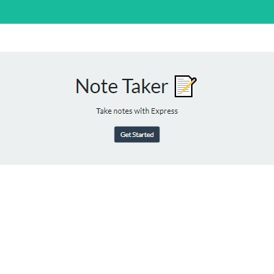

# [11-note-taker](https://mchel-note-taker.herokuapp.com/) 🔗


## Description

A simple application that can be used to write, save, and delete notes

## Preview

| <div align="center">***Screenshot #1***</div>| <div align="center">***Screenshot #2***</div>|
| -------------------------------------------- | -------------------------------------------- |
|            |              |

## Table of Contents ✨

* [Installation 🛠️](#installation)
* [Usage](#usage)
* [Contributing](#contributing)
* [Tests](#tests)
* [Questions](#questions)
* [License](#license)

## Installation

```node
Type the following npm install commands one at a time:
npm install -y, npm i express, npm i uuid, npm i path
```

## Usage ⚙️ <a name="usage"></a>

`Open in Integrated Terminal`

```node
Type the following command to start application:
npm start
```

## Contributing 🤝 <a name="contributing"></a>

All contributions must be approved by owner

## Tests ✅ <a name="tests"></a>

There are currently no testing procedures for this application

## Questions ❓ <a name="questions"></a>

* 📧 If you have any questions please [**eMail**](mailto:dev.mchel@gmail.com) me
* :octocat: Check out more of my work on [**GitHub**](https://github.com/MichelleMcConville)

## License 📝 <a name="license"></a>

This project is **`General Public License v3.0`** licensed

---

 Copyright ©️ 2020 🌷 Michelle McConville
